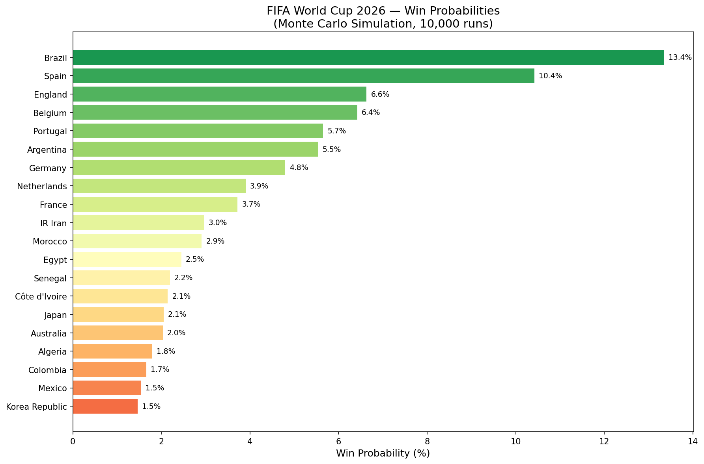
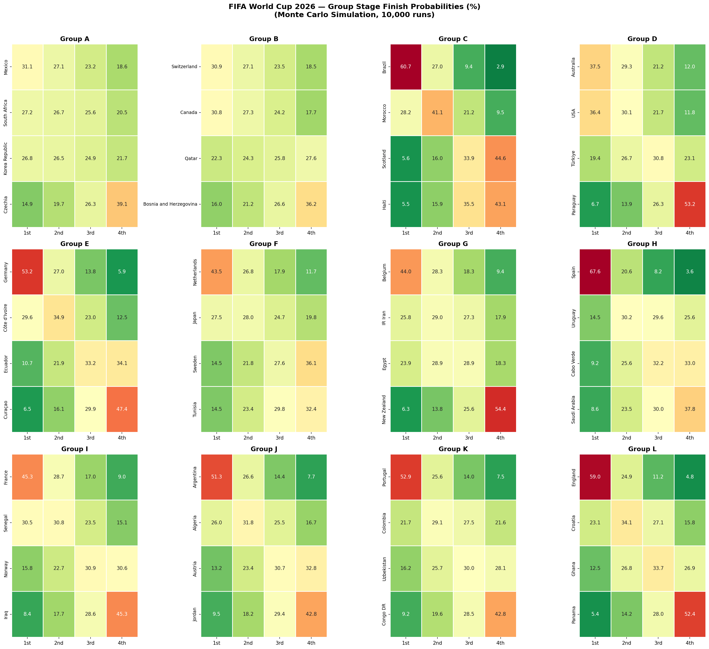
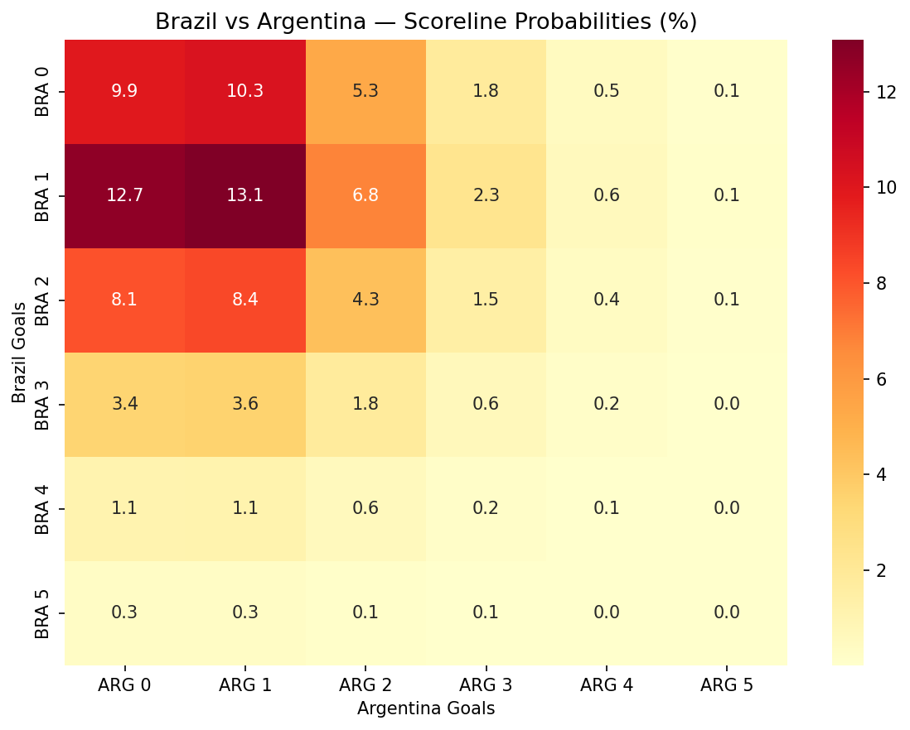

# FIFA World Cup 2026 — Predictive Analytics

Predictive analytics pipeline built in Python to forecast match outcomes, predict scorelines, and simulate the full FIFA World Cup 2026 tournament 10,000 times using Monte Carlo simulation.

**Author:** Lavitra (Lavi) Sharma | MS Business Analytics, UW Foster School of Business

---

## Project Overview

This project applies machine learning and statistical modeling to 30,511 international football matches (1993–2026) to predict the FIFA World Cup 2026 results. Built across four phases:

| Phase | Description | Methods |
|-------|-------------|---------|
| 1 | Data Cleaning & Feature Engineering | Pandas, NumPy, FIFA Rankings merge |
| 2 | Match Outcome Classifier | Logistic Regression, Random Forest |
| 3 | Score Prediction Model | Poisson Regression |
| 4 | Tournament Simulator | Monte Carlo Simulation (10,000 runs) |

---

## Key Findings

- **Brazil** is the model's favourite to win at **13.4%**
- **Spain** second at **10.4%**, followed by England (6.6%) and Belgium (6.4%)
- All 48 qualified teams won the tournament at least once across 10,000 simulations
- FIFA ranking gap and 10-game rolling form delta are the strongest predictive features
- Random Forest achieved **58.6% match outcome accuracy** vs. a 33% random baseline
- Poisson model achieved **59.0% accuracy** on 4,016 post-2022 validation matches

---

## Visualizations

### Tournament Win Probabilities


### Group Stage Finish Probabilities


### Brazil vs Argentina Scoreline Matrix


---

## Data Sources

- [International Football Results 1872–2024](https://www.kaggle.com/datasets/martj42/international-football-results-from-1872-to-2017) — Kaggle (49,287 matches)
- [FIFA World Rankings 1992–2024](https://www.kaggle.com/datasets/cashncarry/fifaworldranking) — Kaggle (67,472 records)

---

## Feature Engineering (53 features)

- **FIFA Rankings** — rank and points for both teams, rank difference, points difference
- **Rolling Form** — goals scored/conceded, win rate, points per game over last 5 and 10 games
- **Form Deltas** — gap in rolling stats between home and away team
- **Tournament Context** — tournament tier (1–5), home advantage, WC qualifier flag, major tournament flag
- **Date Features** — year, month

---

## Models

**Phase 2 — Match Outcome Classifier**
- Target: Home Win / Draw / Away Win
- Logistic Regression: 54.7% accuracy — used for probability outputs in simulator
- Random Forest: 58.6% accuracy — used for feature importance analysis
- Training: pre-2022 matches | Test: 2022–2026 matches
- Class imbalance handled via `class_weight='balanced'`

**Phase 3 — Poisson Score Prediction**
- Models expected goals for each team using attack and defense strength ratings
- Confederation strength adjustment applied to correct for regional opposition quality
- Generates full scoreline probability matrix for any matchup
- 59.0% accuracy on post-2022 validation set

**Phase 4 — Monte Carlo Tournament Simulator**
- Full WC 2026 bracket: 12 groups × 4 teams, Round of 32 → Final
- Each match simulated using Poisson model with random sampling
- 10,000 full tournament runs
- Best 8 third-place teams advance per FIFA 2026 format

---

## Tools & Technologies

`Python` `Pandas` `NumPy` `Scikit-learn` `SciPy` `Matplotlib` `Seaborn` `Jupyter Notebook` `Google Colab`

---

## Repository Structure

```
fifa-wc-2026-analytics/
│
├── WorldCup.ipynb                  # Full project notebook (all 4 phases)
├── team_ratings_final.csv          # Adjusted Poisson attack/defense ratings
├── team_summaries.csv              # Per-team aggregates since 2010
├── wc2026_win_probabilities.csv    # Champion probabilities (all 48 teams)
├── wc2026_group_probabilities.csv  # Group stage finish probabilities
├── wc2026_win_probabilities.png    # Bar chart visualization
├── wc2026_group_heatmap.png        # Group stage heatmap
└── scoreline_matrix_bra_arg.png    # Brazil vs Argentina scoreline matrix
```
